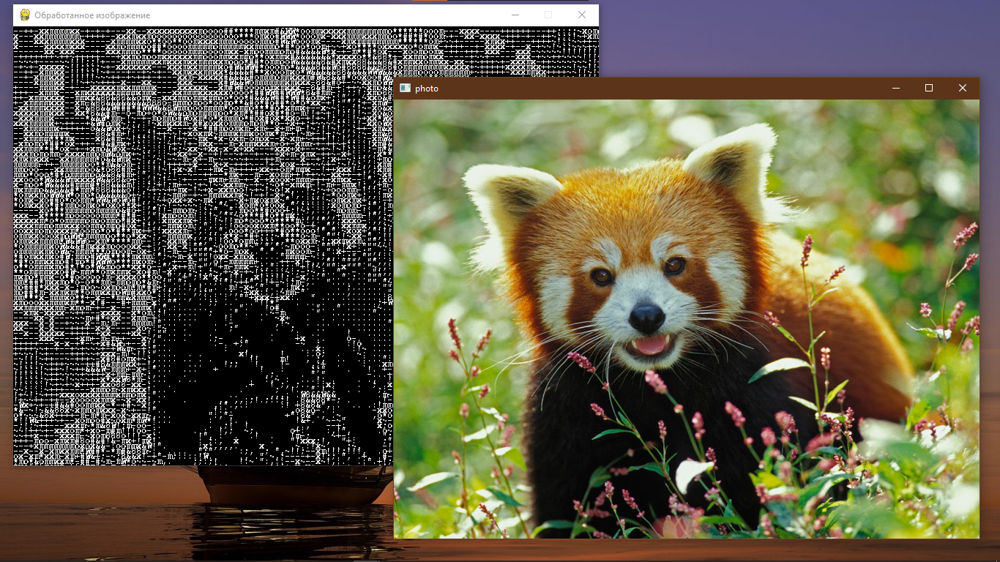
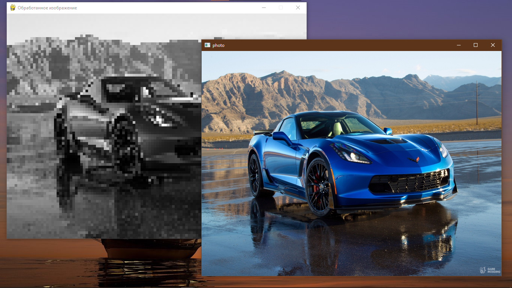
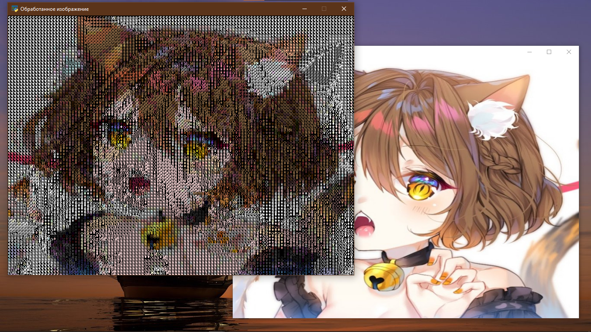
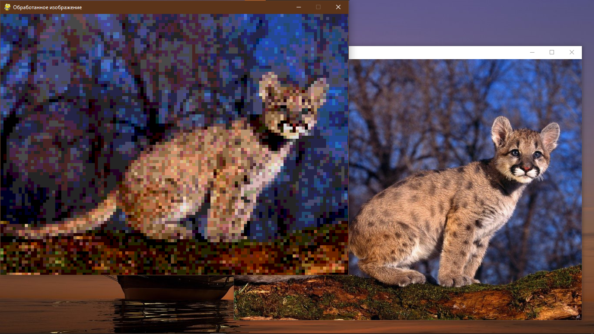

# PhotoPuzzle

### What is it?
It is an application that converts an image into one of the styles (you can keep the original) and uses artificial intelligence to split the image into puzzle pieces that the user then needs to assemble

### What is done?
- Selecting an image
- Convert it into one of the following styles: ASCII, ASCII Color, PIXEL(Gray) and PIXEL Color
- Part of the interface

### How to install?
- Download the repository
- Run main.py

## Screenshots:

